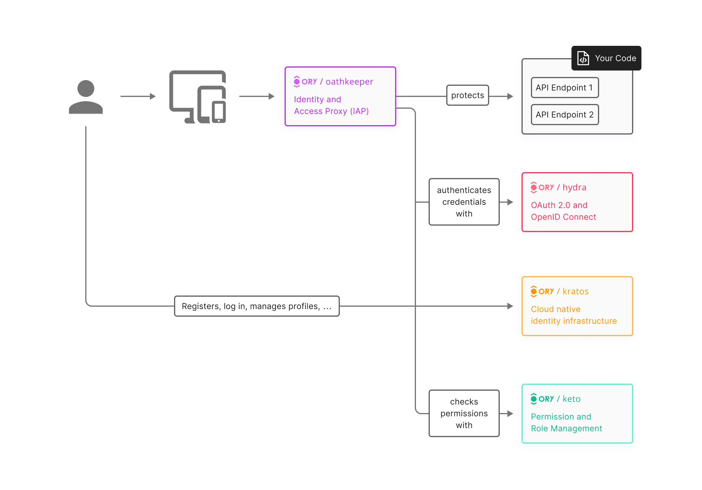

# From Zero to Kratos

Identity infrastructure that feels like code — not a black box.

---

## 🔍 What is Kratos?

Ory Kratos is an open-source identity and user management system built for engineers:

- Fully headless (API-first)
- Manages registration, login, password recovery
- Supports both sessions (cookies) and JWTs
- Identity traits defined via JSON Schema

---

## 🧩 Why Kratos?

- 🔧 Fully customizable flows (registration, login, etc.)
- 🧠 No UI lock-in — bring your own frontend
- 🔐 Secure by default: CSRF protection, hashed passwords, verified flows
- 🧪 Built-in identity validation via JSON schema
- 🔄 Works with browser sessions or machine clients

---

## 🧱 Ory Ecosystem

- **Kratos** — identity and sessions
- **Hydra** — OAuth2/OpenID Connect server
- **Oathkeeper** — identity-aware proxy/gateway
- **Keto** — permission engine (Zanzibar-style access control)

🧩 Start with Kratos. Grow into the rest.



---

## 🔐 What is Zanzibar-style Access Control?

Zanzibar-style = relationship-based access control.  
It answers:  
**"Can user X do action Y on resource Z?"**

### 🧠 Key Concepts
- Resources (e.g. documents, files)
- Subjects (users, groups, roles)
- Relations (viewer, editor, owner)
- Permissions derived from these relationships

### 🧩 Example
```yaml
document:report-2024:
  relations:
    viewer: [user:Ihor]
    editor: [group:team-red]
    owner:  [user:Stepan]
```

Check:  
_"Can `Ihor` edit `report-2024`?"_ → No, but can view.

### ✅ Why it matters
- Works at scale (millions of objects)
- Flexible for orgs, roles, subscriptions, time-based access
- Clean separation of permission logic from app code

---

## ⚔️ Kratos vs Others

| Feature                       | Kratos       | Keycloak | Auth0        |
|-------------------------------|--------------|----------|--------------|
| Open-source                   | ✅            | ✅        | ❌ (limited)  |
| Self-hosted                   | ✅            | ✅        | ⚠️ via proxy |
| Headless (no UI lock-in)      | ✅            | ❌        | ❌            |
| Provided UI                   | ❌ (ref impl) | ✅        | ✅            |
| Custom Flow Logic             | ✅            | ⚠️       | ❌            |
| Authorization Engine          | ❌ (Keto)     | ✅        | ✅            |
| OAuth2 / OIDC Support         | ❌ (Hydra)    | ✅        | ✅            |
| JSON Trait Validation         | ✅            | ❌        | ❌            |
| Webhook Support               | ✅            | ⚠️       | ❌            |
| Multi-Factor Auth (TOTP)      | ✅            | ✅        | ✅            |
| Email Verification & Recovery | ✅            | ✅        | ✅            |
| Admin API                     | ✅            | ✅        | ⚠️ Limited   |

---

## 🧪 Full Demo Flow Overview

During the live demo, we will cover:

- ✅ **Self-service UI:** Register → Verify Email → Login → Logout
- ✅ **API interactions:** curl requests to `/self-service/*` endpoints
- ✅ **MFA setup:** TOTP via authenticator app (if enabled)
- ✅ **Password recovery flow**
- ✅ **Webhooks** triggered on key identity lifecycle events
- ✅ **User traits** and identity schema validation

---

## 🧰 Database Structure Overview

Kratos uses a PostgreSQL-compatible schema with these key tables:

- `identities` — each user; JSON field `traits` stores custom fields (e.g., email, name, role)
- `identity_credentials` — password hashes, OIDC data, TOTP secrets
- `sessions` — issued session tokens (cookie or JWT)
- `self_service_flows` — tracks current state of login/registration/recovery
- `verification_codes`, `recovery_codes` — temporary codes for flows
- `courier_messages` — emails pending/sent (integration with SMTP)

This structure makes the system modular and debuggable via database inspection.

---

## 🚀 Quickstart

Use the provided `Makefile` for easy management of your local Kratos demo stack:

### 🔧 Common Commands

```bash
make build      # Build containers
make up         # Start services in background
make down       # Stop and remove services
make logs       # Tail logs from all services
make restart    # Restart everything
make clean      # Remove volumes and prune network
make clean-all  # Deep cleanup: containers, images, volumes
```

All services (Kratos, UI, MailSlurper, Postgres) will be started via `docker-compose.yml`.

